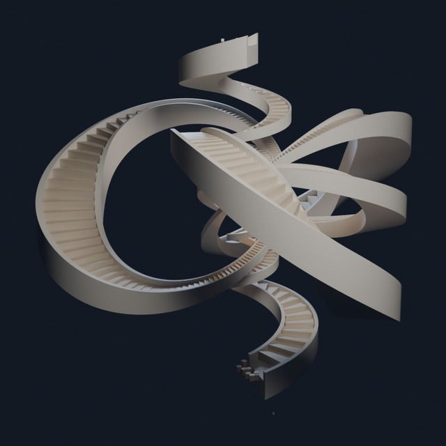
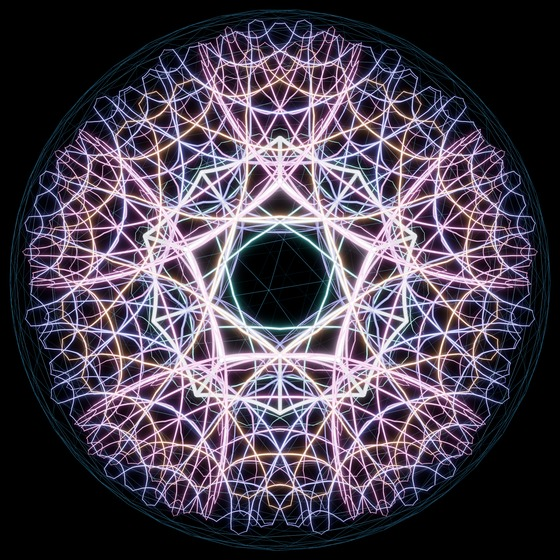
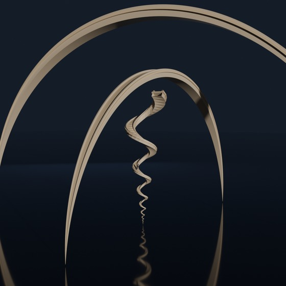
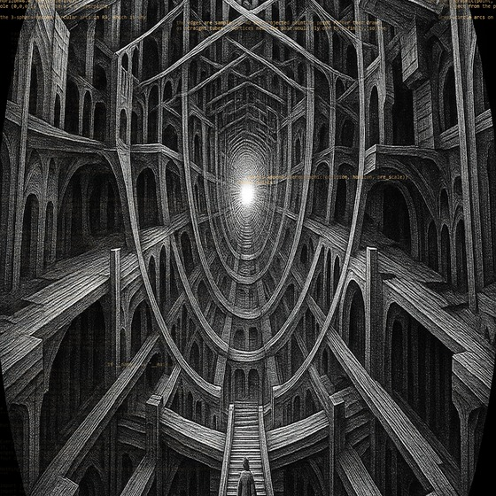

  
  
  
  

<h3 align="center">Randall Morgan</h3>

  <b>Design engineer.</b> I build and ship products solo, AI-assisted. 
  Desktop apps &middot; browser tools &middot; 3D software &middot; every one of these is live and paid for

  <a href="https://pardesco.com">pardesco.com</a> &nbsp;·&nbsp;
  <a href="https://laserburnai.com">laserburnai.com</a> &nbsp;·&nbsp;
  <a href="https://x.com/pardesco_">@pardesco_</a>

---

### Shipped

| | | |
|---|---|---|
| **[HYPERNOVUM](https://github.com/Pardesco/hypernovum)** | Turns your notes into a 3D city you can walk, then puts a fleet of AI coding agents to work inside it — and lets you watch them | `89★` · desktop |
| **[Reshoot](https://superhivemarket.com/products/reshoot)** | Relight and re-render a 3D scene with AI without leaving the app | `$39` · 3D tool |
| **[4D Polytope Engine](https://pardesco.com/products/4d-polytope-engine)** | Brings a class of geometry into 3D software that nothing else on the market handles | `$29` · 3D tool |
| **[VesselLab](https://superhivemarket.com/products/vessellab)** | Design vases, lampshades and planters by dragging sliders; exports print-ready files | `$29` · 3D tool |
| **[Ornament Studio](https://laserburnai.com/tools/ornament-studio)** | Generates intricate geometric patterns as cut-ready vector files | `$29` · browser |
| **[LaserBurnAI tools](https://laserburnai.com/tools)** | Free and client-side — nothing uploaded, nothing tracked: layered slicer, sheet nesting, image→3D, box generator | free · browser |

### Open source

| | |
|---|---|
| **[algorithmic-art-skill](https://github.com/Pardesco/algorithmic-art-skill)** | An AI agent skill for generative art — reproducible from a seed, self-critiques its own output, exports to print, video and machine formats |
| **[codex-review](https://github.com/Pardesco/claude-codex-review-skill)** · **[agy-bug-search](https://github.com/Pardesco/claude-agy-bug-search-skill)** | Get a second and third opinion on your code from a *different* AI model family, then have the first one triage the findings |
| **[4d-polytope-viewer](https://github.com/Pardesco/4d-polytope-viewer)** | Browser-based interactive geometry viewer. 1,700+ shapes, WebGL, no install |
| **[envelope-extrusion-explorer](https://github.com/Pardesco/envelope-extrusion-explorer)** | Independent replication of a published result, including the identity its examples actually relied on |

### Stack

  

TypeScript · Python · React + Three.js / WebGL · Cloudflare Workers &amp; Pages · Electron · Blender Python API · Claude Code, Codex and Antigravity in the loop daily

---

  

Most of what I build lives in private repos — the graph above is a fraction of it.

